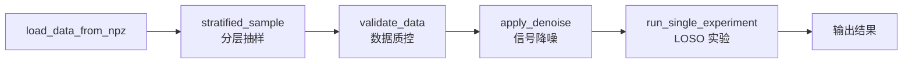

# DFDNxbq 函数包使用教程

## 快速开始

```r
library(DFDNxbq)
install_dfdnxbq_deps()                    # 首次需安装 torch 后端

data_list <- load_data_from_npz("signals.npz", "metadata.csv")
result <- run_pipeline(data_list)          # 一键运行全流程
```

`run_pipeline` 内部流程：



---

## 实验配置

通过修改 `BASE_CONFIG` 控制所有参数：

```r
cfg <- BASE_CONFIG
cfg$encoder_type   <- "conv_lstm"     # cnn | conv_lstm | gru_tcn_se
cfg$denoise_method <- "butterworth"   # none | butterworth | kalman | wavelet | savgol
cfg$use_hiba       <- TRUE            # 是否启用 HIBA 注意力
cfg$n_epochs       <- 50
cfg$d_model        <- 64              # 嵌入维度
cfg$focal_alpha    <- 0.5             # Focal Loss 正类权重
cfg$focal_gamma    <- 1.0             # Focal Loss 聚焦参数
cfg$tune_classifiers <- TRUE          # 是否在验证集上调分类器参数
```

常用参数组合：

| 场景 | encoder_type | d_model | use_hiba | n_epochs |
|------|-------------|---------|----------|----------|
| 快速调试 | cnn | 16 | FALSE | 10 |
| 对照实验 | conv_lstm | 64 | TRUE/FALSE | 30-50 |
| 追求最佳 | gru_tcn_se | 64-128 | TRUE | 50-100 |

> 完整参数见 `BASE_CONFIG`（DFDNxbq-package.R:134-219）。

---

## 函数调用方式

### 方式一：一键管道

```r
result <- run_pipeline(data_list, output_dir = "output",
  sample_ratio = 0.01,            # NULL=用全部数据, <1=抽样比例
  config_overrides = list(encoder_type = "cnn"))
```

### 方式二：分步精细控制（推荐研究用）

```r
# ① 数据准备
labels   <- build_labels(data_list)
subjects <- build_subjects(data_list)

# ② 降噪
data_denoised <- apply_denoise(data_list, method = cfg$denoise_method, fs = cfg$fs)

# ③ 运行 LOSO 实验
result <- run_single_experiment(cfg, data_denoised, labels, subjects,
  exp_name = "my_exp", output_subdir = "output/my_exp")
```

### 方式三：模块独立使用

```r
# 降噪（可单独调用）
acc_f <- butterworth_filter(acc_mat, sampling_rate = 238, cutoff = 15)
klm   <- kalman_filter(acc_mat);  acc_f <- klm$filtered
acc_w <- wavelet_denoise(acc_mat, wavelet = "d4", n_level = 4)
acc_s <- savgol_filter(acc_mat, p = 3)

# 训练深度模型（手动提取嵌入 → 分类）
model_pkg <- train_patch_hiba_model(train_patches, train_y, val_patches, val_y, ...)
embedding <- extract_patch_hiba_embedding(model_pkg$model, test_patches)$embedding

# 独立分类器
rf_model  <- train_rf(embedding, labels, ntree = 100)
rf_pred   <- predict_rf(rf_model, test_embedding)

svm_model <- train_svm(embedding, labels, kernel = "linear")
svm_pred  <- predict_svm(svm_model, test_embedding)

cb_model  <- train_catboost(embedding, labels, iterations = 500)
cb_pred   <- predict_catboost(cb_model, test_embedding)

# 评估
metrics <- calc_metrics(true_labels, pred_prob, threshold = 0.5)
bt      <- find_best_threshold(val_true, val_prob)
agg     <- aggregate_predictions(win_preds, win_orig_idx, aggregator = "mean")
```

---

## 结果解读

```r
names(result$final_metrics)
# 输出项: rf, svm, catboost, ensemble, rf_global, svm_global, catboost_global, ensemble_global
#         ^^^^^ 深度特征路径 ^^^^^   ^^^^^^^^^^^^^ 手工特征基线路径 ^^^^^^^^^^^^^

# 查看指标
result$final_metrics$ensemble$metrics  # AUC, F1, Recall, Specificity...
result$final_metrics$ensemble$confusion # 混淆矩阵
result$fold_history                     # 训练曲线
result$attention_data                   # HIBA 注意力权重（use_hiba=TRUE 时）
```

---

## 对比实验模板

```r
# 切换编码器
for (enc in c("cnn", "conv_lstm", "gru_tcn_se")) {
  cfg$encoder_type <- enc
  run_single_experiment(cfg, data, labels, subjects, exp_name = enc)
}

# 消融 HIBA
cfg$use_hiba <- TRUE;  run_single_experiment(cfg, ..., exp_name = "w_hiba")
cfg$use_hiba <- FALSE; run_single_experiment(cfg, ..., exp_name = "wo_hiba")

# 对比降噪方法
for (dn in c("none", "butterworth", "wavelet", "kalman", "savgol")) {
  cfg$denoise_method <- dn
  run_single_experiment(cfg, ..., exp_name = dn)
}
```

---

## 完整示例

见 `inst/examples/run_experiment.R`，包含从数据加载到结果输出的完整可运行代码。
